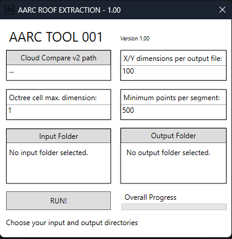

# Roof Extractor / Batch LIDAR Processor

A simple windows tool using cloud compare to extract roofs from large .las datasets.

You can input a folder containing multiple files and this tool will output .asc point cloud files per building organized by input file.

